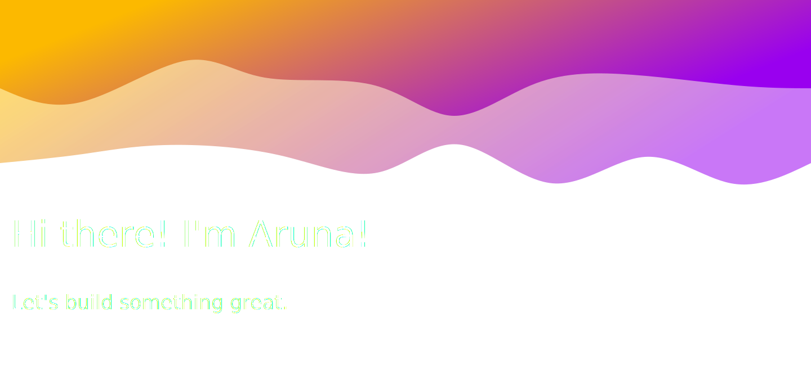

    

### 💻 &nbsp;About Me

- 🤔 &nbsp; Delving into innovative technologies and crafting software solutions for global tech challenges.
- 🥰 &nbsp; Passionate about delving into diverse AI domains and leveraging cutting-edge models and tools
- 🎓 &nbsp; Studying Computer Science at the University of Washington.

  
<h3>🛠 &nbsp;My Tech Stack</h3>

   

- 🌐 &nbsp; Frontend
  
  
  
  
  
  
  
  
  
- ⚙️ &nbsp;
  
  
  

- 🔧 &nbsp;
  
  
  
  
  
 
- ⌨️ &nbsp; Backend
  
  
  
  
  
  
  

  

## Stats

<a href="https://github.com/AVS1508">
<!--    -->
  
</a>
   

##  🤝🏻 &nbsp;Connect with Me

  
  

<!--
**arunasrivastava/arunasrivastava** is a ✨ _special_ ✨ repository because its `README.md` (this file) appears on your GitHub profile.
