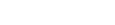

    

### 💻 &nbsp;About Me

- 🚀 &nbsp; Pushing the boundaries of speech and audio models
- 🥰 &nbsp; Passionate about delving into diverse AI domains and driving technology for social impact and safety!
- 🎓 &nbsp; CS at the University of Washington. go dawgs!

## <a href="https://www.linkedin.com/in/arunasr">🤝</a>  &nbsp; Always happy to chat!  

 
  &nbsp;&nbsp;
  

<!--
**arunasrivastava/arunasrivastava** is a ✨ _special_ ✨ repository because its `README.md` (this file) appears on your GitHub profile.
